# Block Designs

## Black-Box System
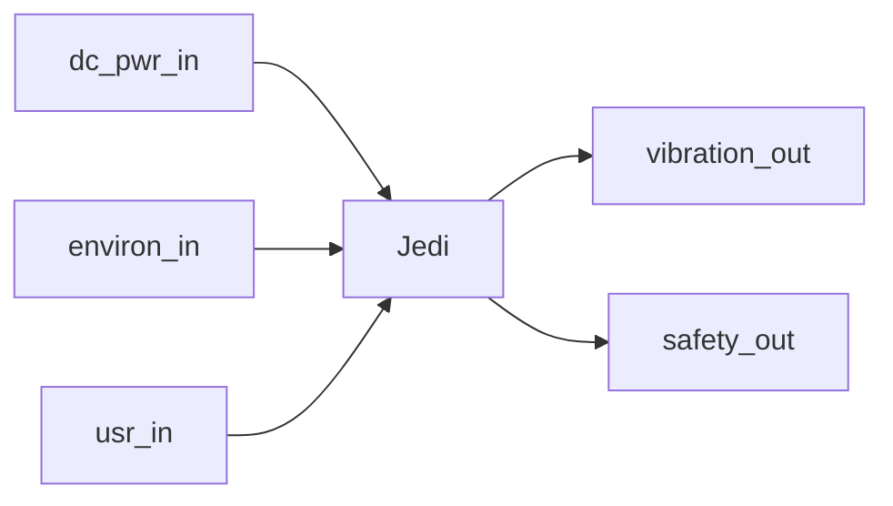

## Top-Level System
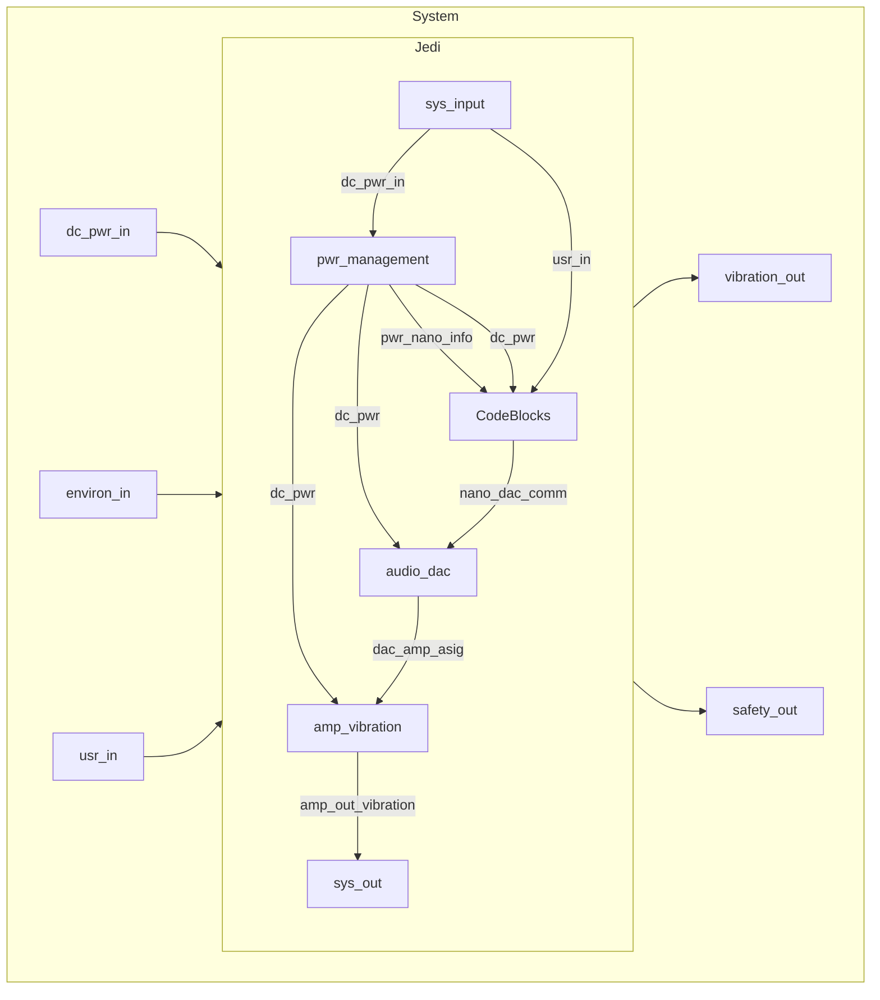

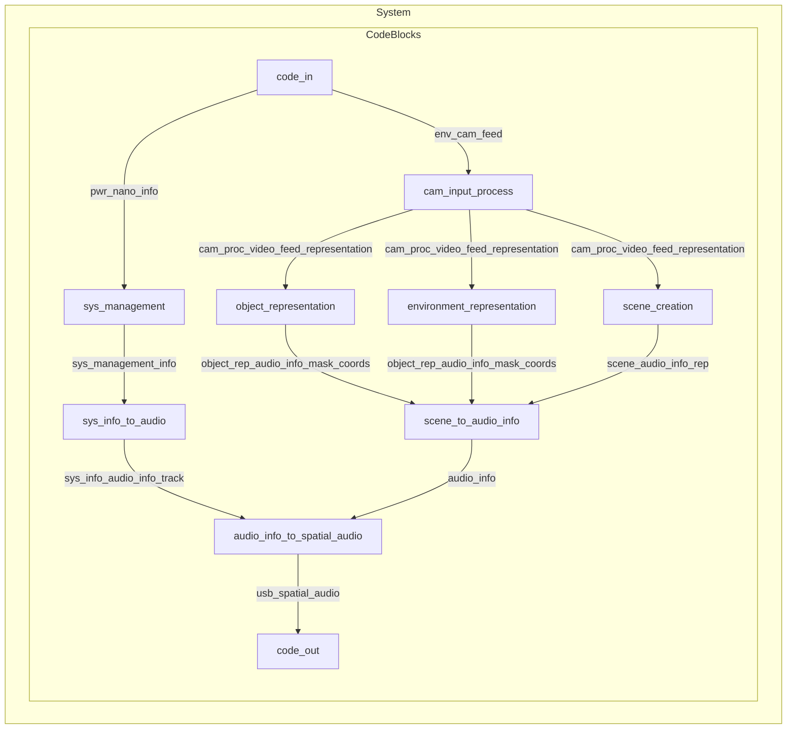

### Individual Blocks

#### Power Management Block: USB power to battery management
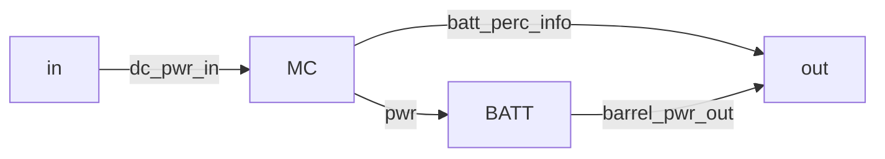

#### Mode Switch Block
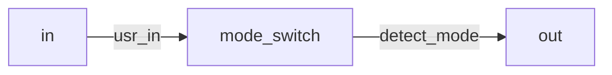

#### Camera Block
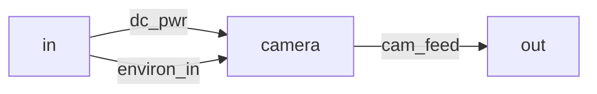

#### Camera Input Processing Block
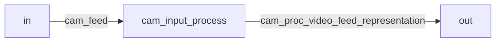

#### Visual to Scene Block
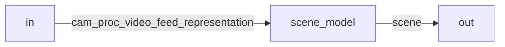

#### Path Representation Block
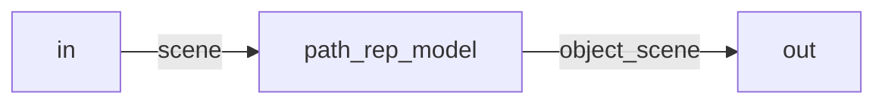

#### Object Representation Block
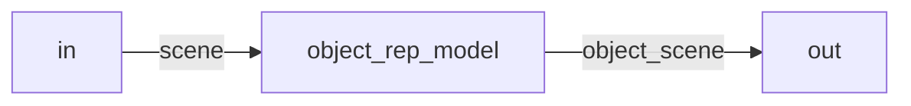

#### Scene to Audio Info Block
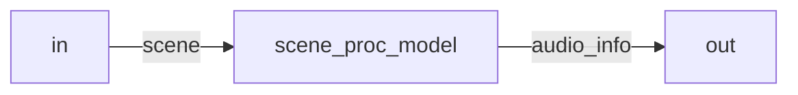

#### Audio Info to Spatial Audio Block
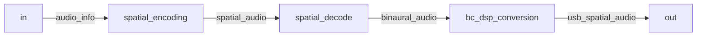

#### Audio Ddc Block: USB audio to analog
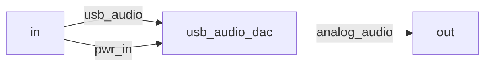

#### Stereo Amp Block: Surround analog audio to L/R audio
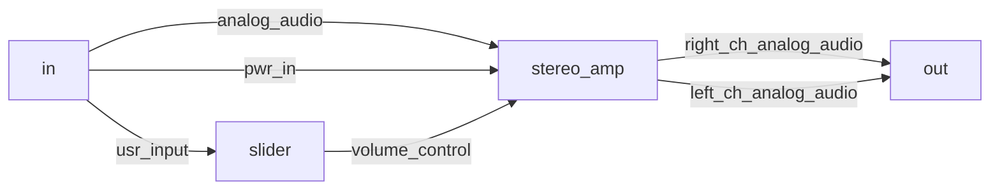

#### Transducer Block: L/R audio to vibrations
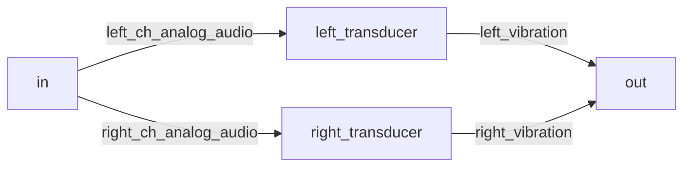